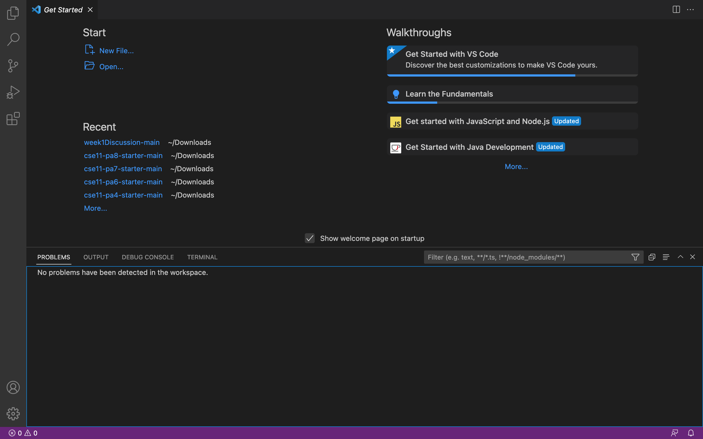
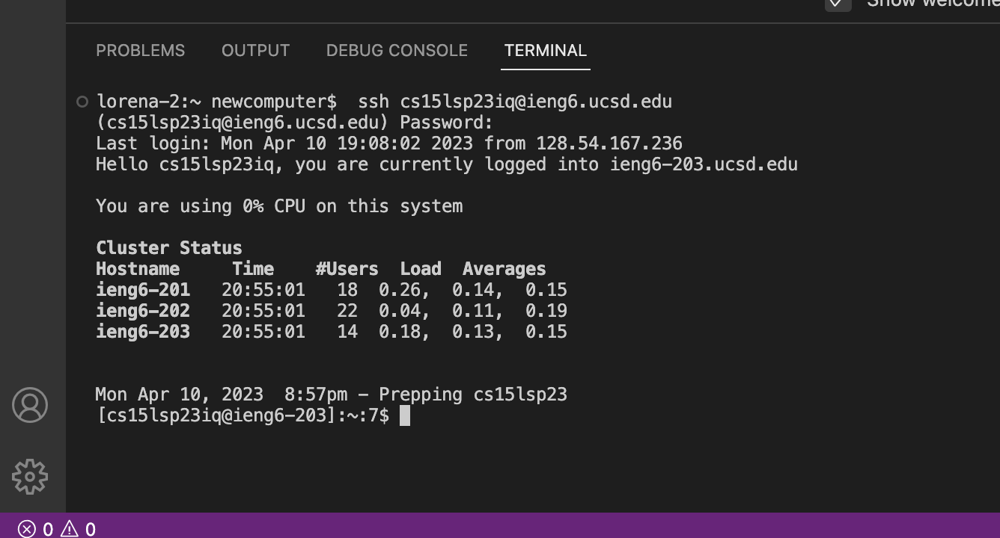
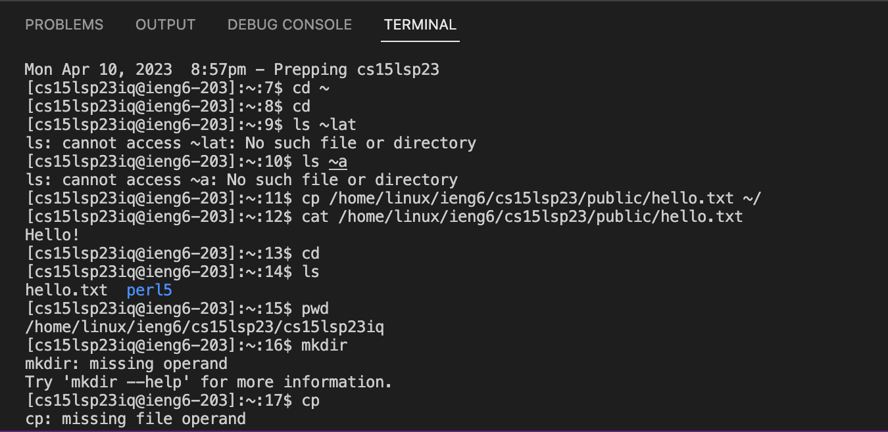

# Installing VScode

If VScode is not already installed on your computer, here is the link: [VSCode Installation](https://code.visualstudio.com/)

There are instructions for downloading and installing VSCode on your computer. I already had it installed so I was able to skip this step for today! 
As you know, there are different versions to install for macOS and Windows so make sure you follow the right directions for the one that works for you!

My page might look a bit different than yours if you just installed it but no worries.



# CSE15L account
Prior to remotely connecting, I had to set my password for my course-specific account on ieng6. 
You can look up your course-specific account for CSE 15L here: [ieng6](https://sdacs.ucsd.edu/~icc/index.php)

The following page will be shown, you can type your username and your studentID in order to find your account.
.png)

I had to reset my password prior to connecting to this remote server. 

.png)

In order to do that, click on your course-specific account under "Additional Accounts". It should be the one beginning with cs15lsp23zz (the last two letters should be specific to you).

Now, the following page is shown. Click on the hyper link named 'Global Password Change Tool', as seen in blue. 
.png)

I have already reset my password so I will not be doing the steps further but after setting your password, we can proceed to the next steps!


# Remotely Connecting
In VScode you want to open up the terminal, you can do this by going to Terminal --> New Terminal.
In this terminal you want to type the following:

`$ ssh cs15lsp23zz@ieng6.ucsd.edu`

Note that you don't need to type the $, but everything after that.
You will have to replace the letters 'zz' with the 2 letters in your course-specific username.

Once you enter this, the following will occur if this is your first time connecting to this server.
```
⤇ ssh cs15lsp23zz@ieng6.ucsd.edu
The authenticity of host 'ieng6.ucsd.edu (128.54.70.227)' can't be established.
RSA key fingerprint is SHA256:ksruYwhnYH+sySHnHAtLUHngrPEyZTDl/1x99wUQcec.
Are you sure you want to continue connecting (yes/no/[fingerprint])? 
```

Type in yes and hit enter, it should then ask for your password. 
Type in your password and hit enter once again. 

You should see something similar to the image below. 



Now this means that the terminal is now connected to a computer in the CSE basement!

Now we can run some of the commands we have learned!

# Trying Some Commands

We can try the commands we have learned, `cd`, `ls`, `pwd`, `mkdir`, and `cp`.
I tried variations of these commands as seen below. 



