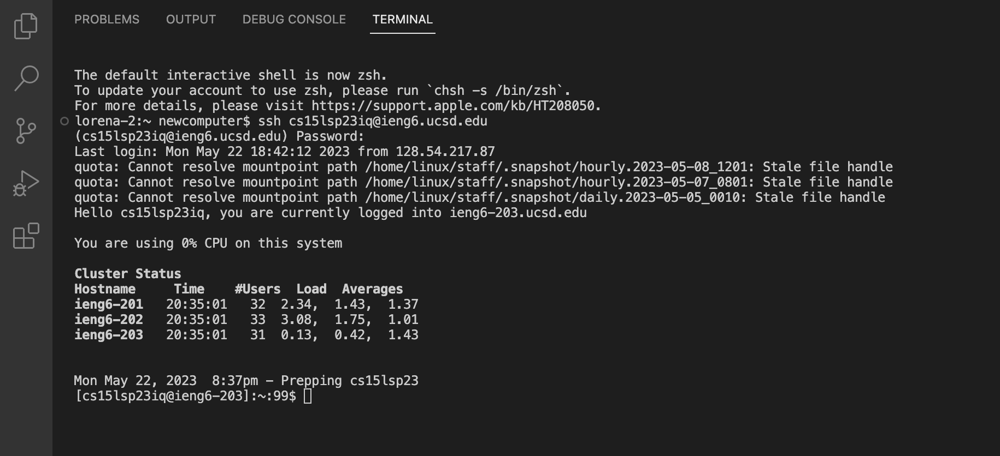
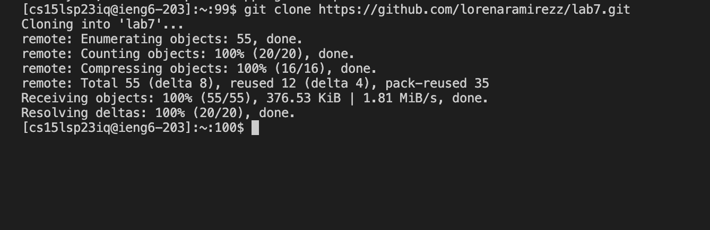
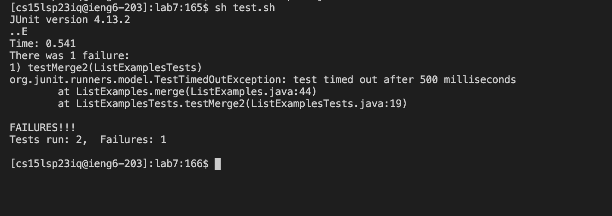
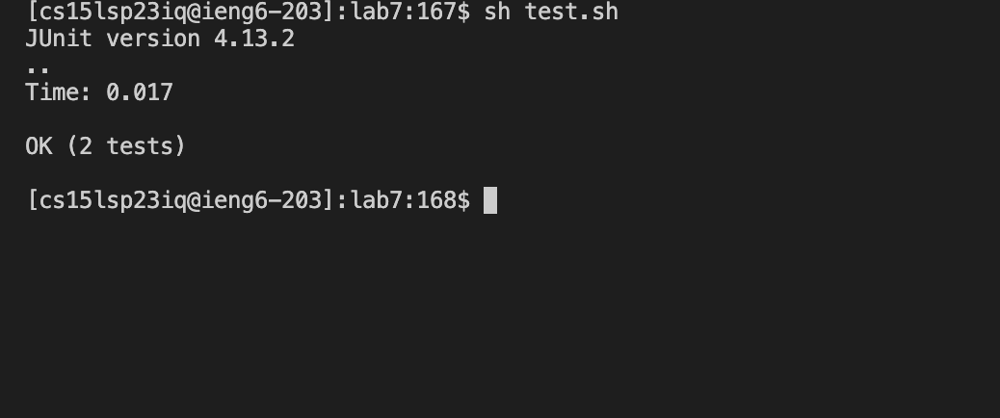
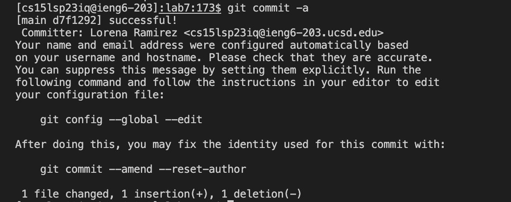
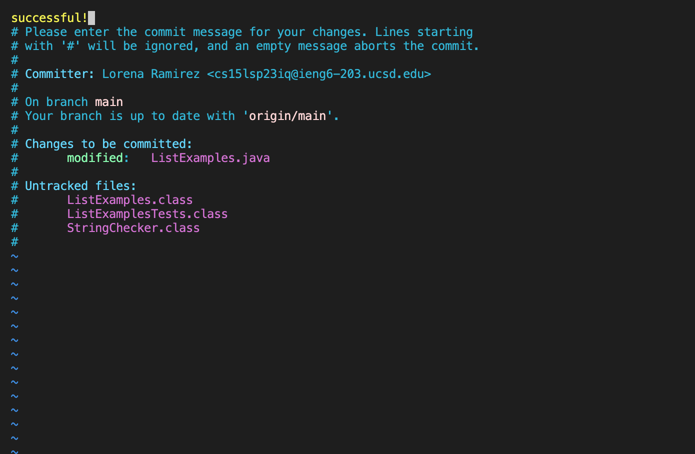

# Lab Report 4
# Working in vim

In this lab report, I will be reproducing the tasks that we did in lab, inlcuding opening a file in vim and editing it. I did all of these steps in the 
terminal in VS Code. 

First I had to log into my ieng6 account. 

Keys Pressed: `ssh cs15lsp23iq@ieng6.ucsd.edu`  
 
After typing in my password, I clone the fork of the repository from my Github account. In order to do this in the terminal I used  
`git clone https://github.com/lorenaramirezz/lab7.git`

After cloning this repository I had to run the command `cd lab7` so that I was in the right directory.  
I ran the test before I fixed any of the errors and the output is shown below:

In order to open the file in vim and edit it, I ran the command `vim ListExamples.java` in the terminal. 

This opened up the file in vim. In order to move my cursor down to line 44, where the error was, I learned that instead of holding `j` down, I could type the number of lines that I would want to move down, followed by `j`. I then used the letter `l` to move my cursor to the right and positioned it right after the 1 that I was going to delete. I used `i` to go into insert mode and pressed `<delete>` to delete the number one and replace it with `2`.   

  Keys Pressed: `43j, l, l, l, l, l, l, l, l, l, l, l, l, i, <delete>, 2`  
  
Here is what that line looked like after I made the correct changes. 
  
  
After I made these changes, I pressed `<esc>` to leave insert mode and pressed `:wq` to save my file and quit.  
Keys Pressed: `<esc>, :wq`  
  
I ran the test again by pressing the arrow keys, using the up key to look at the commands that I used previously.  
Keys Pressed: `<up>, <up>, <enter>` 

  
  
After successfully making the change I used `git commit -a`.
  Here is the output below:
  

These are all the keys I pressed for steps 4-9 in summary:  
4. `ssh cs15lsp23iq@ieng6.ucsd.edu`  
5. `git clone https://github.com/lorenaramirezz/lab7.git`  
6. `cd lab7`  
`sh test.sh`  
7. `vim ListExamples.java`  
`43j, l, l, l, l, l, l, l, l, l, l, l, l, i, <delete>, 2`  
`<esc>, :wq`  
8. `<up>, <up>, <enter>`  
9. `git commit -a` 
  

  
  
  
  
  
  
  
  
  
  

