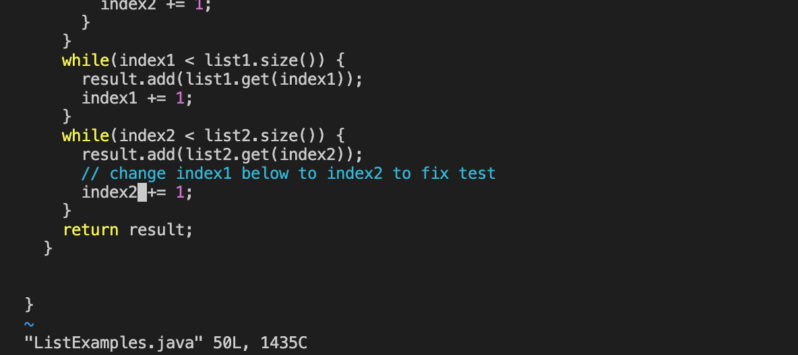

## Lab Report 4
# Working in vim

In this lab report, I will be reproducing the tasks that we did in lab, inlcuding opening a file in vim and editing it. I did all of these steps in the 
terminal in VS Code. 

First I had to log into my ieng6 account. 

Then I clone the fork of the repository from my Github account. In order to do this in the terminal I used 
`git clone https://github.com/lorenaramirezz/lab7.git`

After cloning this repository I had to run the command `cd lab7` so that I was in the right directory.
I ran the test before I fixed any of the errors and the output is shown below:

In order to open the file in vim and edit it, I ran the command `vim ListExamples.java` in the terminal. 

This opened up the file in vim. In order to move my cursor down to line 44, where the error was. I held down the letter 'j' until I was on the line I need to
change. I then used the letter 'l' to move my cursor to the right and positioned it right after the 1 that I was going to delete. I used 'i' to go into 
insert mode and pressed <delete> to delete the number one and replace it with "2". 
  
Here is what that line looked like after I made the correct changes. 
  
  
After I made these changes, I pressed <esc> to leave insert mode and pressed ':wq' to save my file and quit. 
  
I ran the test again by pressing the arrow keys, using the up key to look at the commands that I used previously. 

  
  
After successfully making the change I used `git commit -a`.
  Here is the output below:
  

  

  

  
  
  
  
  
  
  
  
  
  

