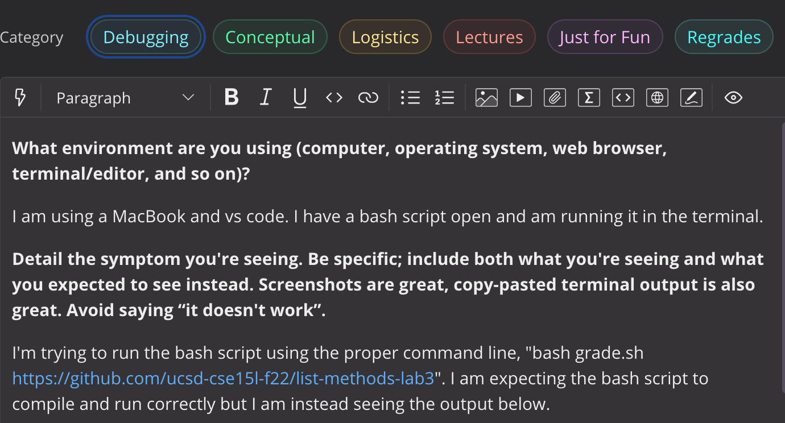
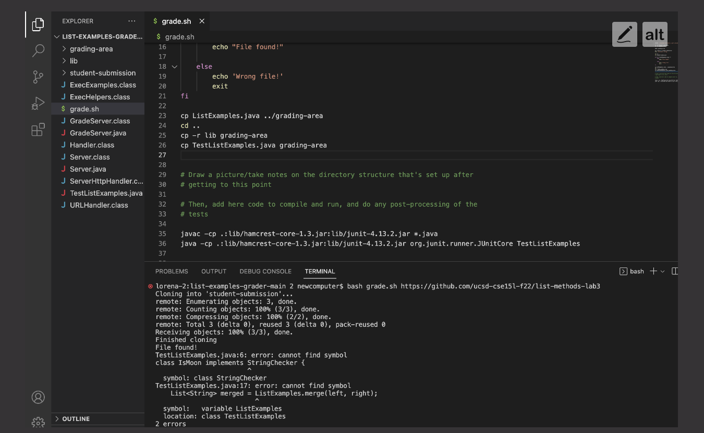
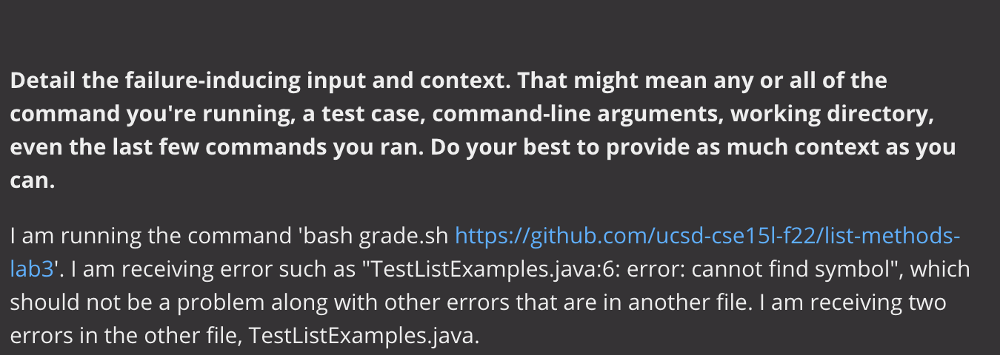
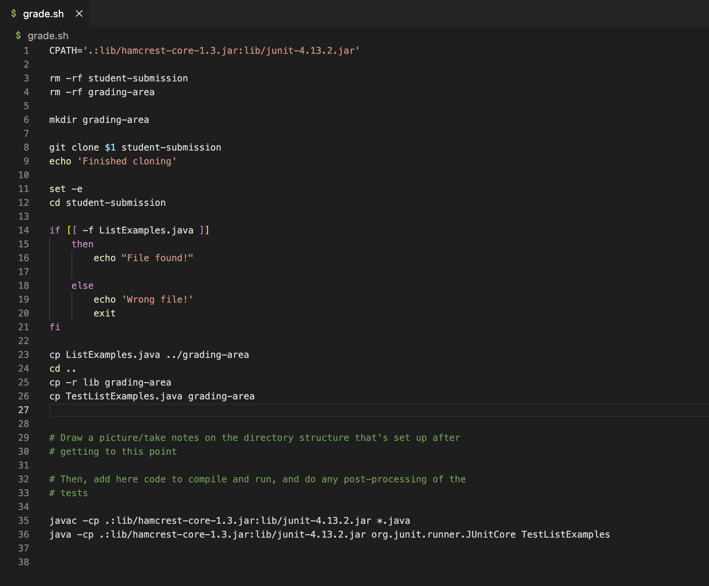
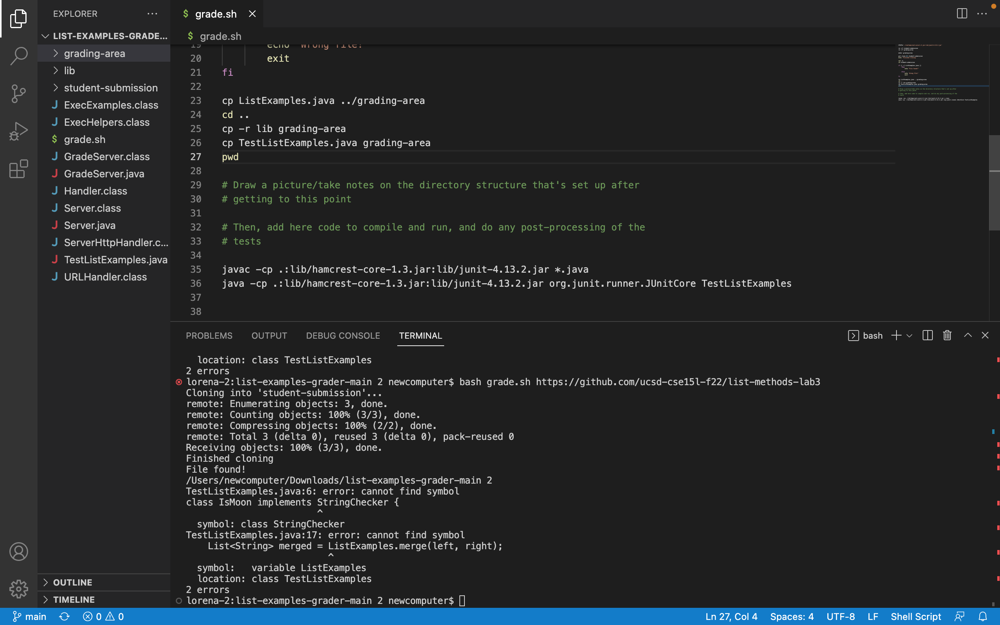

# Lab Report 5 - Debugging Scenario

Here is the full bash script from above:

## Response from TA
It's hard to tell from just the screenshot but it's important to know of the other factors such as the current working directory. As seen in your grade script,
it seems like you changed the working directory to the home directory in line 24 with `cd ..`. You can include the command `pwd` in your script in order to see
what your current working directory is and see if that is an issue. It's always important to know what your directory looks like. 
 

## Solution

After including this line I was able to figure out that we were not in the right directory after printing the working directory. In order to fix this issue, I had
to cd into `student-submission` before I compile and run the java files. It was interesting that this errror made it seem like this occurred from the java file TestListExamples but it was from being in the wrong directory. 

## Reflection 
Something that I learned how to do this quarter was to use bash scripts. I didn't know that we can use these types of files to store different commands in order to run tests or to do things such what goes on behind the scenes when our programming assignements get graded. Working on the grading script has helped me understand and  put these different tools in action, from using an if statement in order to find the right files to moving around the file system and using these basic commands such as `pwd`, `cp` and `cd` in these bash scripts. This lab was definetely a challenge but it was helpful to work in partners and work with different groups. 

